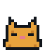

# zprynne.github.io

My personal site. Plain HTML/CSS/JS, no build step. Hosted on GitHub Pages,
which serves straight from `main` (`.nojekyll` skips Jekyll processing).

Live at [zprynne.github.io](https://zprynne.github.io).

## Running locally

Open `index.html` directly, or serve it so relative paths behave like production:

```bash
python3 -m http.server 8080
```

## What's what

- `index.html` — the home page: about, projects, sidebar, footer buttons
- `resume.html` — renders `resume.pdf` inline with PDF.js (native PDF embeds don't work in Safari)
- `resume-src/` — LaTeX source for the resume
- `styles.css` — all styling; colors are CSS variables at the top
- `fx.js` — visit counter, sparkle trail, and stopping the marquee for reduced motion
- `amp.js` — ZAMP, the Winamp-style player; the tunes are note lists synthesized with Web Audio
- `pals.js` — the footer pals (parked, see below)
- `assets/` — every image on the site (generated, see below)
- `assets-src/make_assets.py` — draws the assets: title, pixel pals, starfield,
  badges, dividers and 88x31 buttons

The look is a late-90s home page. The page works without JavaScript; `fx.js`
only adds extras. The "Last updated" line in the footer is updated by hand.

## Changing the images

Sprites and badges are defined as data in `assets-src/make_assets.py` (character
maps for pixel art, label text for buttons). Edit, then regenerate:

```bash
python3 -m venv .venv && .venv/bin/pip install pillow
.venv/bin/python assets-src/make_assets.py
```

It uses the macOS core web fonts in `/System/Library/Fonts/Supplemental`.
Animated GIFs get a still `.png` twin for visitors with "reduce motion" on.

## Caching

GitHub Pages lets browsers cache files for 10 minutes, and browsers often keep
them longer. `styles.css`, the scripts and the favicon are linked with a
`?v=N` suffix: bump N in `index.html` and `resume.html` whenever one of them
changes, so returning visitors get the new file straight away.

## Parked: footer pals

The cat, dog and Tux used to wander a grass strip at the bottom of the page
and react when clicked. They're switched off, but everything is still here:
`pals.js`, the `.yard`/`.pal` styles in `styles.css`, and the sprites
(`cat.gif`, `cat-awake.png`, `dog.gif`, `tux.gif`, `heart.png`, `grass.png`).
To bring them back, paste this at the end of the `<footer>` in `index.html`:

```html
<!-- The pals' yard. pals.js sets them wandering; click one to pet it. -->
<div class="yard" role="group" aria-label="Pixel pals">
  <button type="button" class="pal" data-pal="cat" aria-label="Pet the cat"></button>
  <button type="button" class="pal" data-pal="dog" aria-label="Pet the dog"></button>
  <button type="button" class="pal" data-pal="tux" aria-label="Pet Tux the penguin"></button>
</div>
```

and add `<script src="pals.js?v=2" defer></script>` next to the other
scripts at the bottom of the page.
